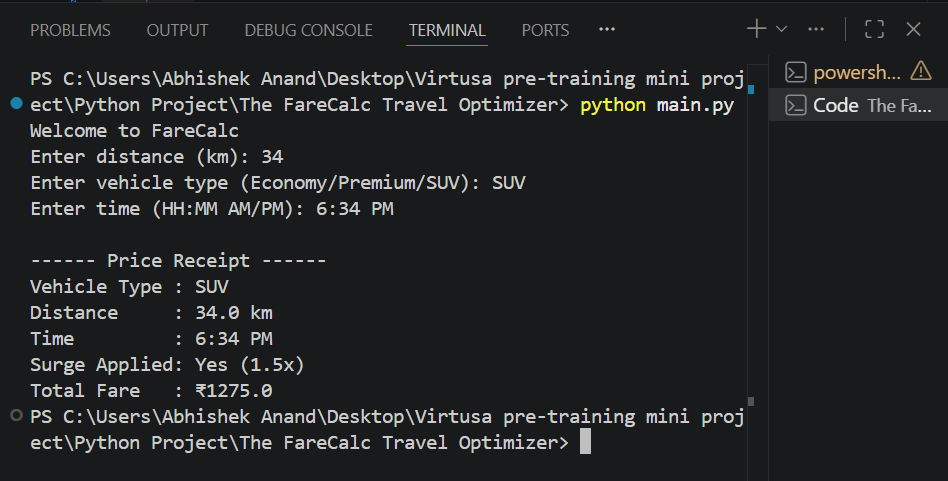

# FareCalc - Travel Fare Optimizer

## Project Overview

FareCalc is a Python-based backend script designed for a ride-sharing startup.
It calculates ride fares dynamically based on distance, vehicle type, and time of booking.

---

## Problem Statement

Ride fares are not fixed and depend on multiple factors such as:

* distance traveled
* vehicle type selected
* time of booking (peak hours)

The goal is to calculate a final ride estimate using these parameters.

---

## Objectives

* Implement fare calculation logic
* Apply surge pricing during peak hours
* Handle invalid user inputs
* Convert and manage time formats
* Generate a formatted price receipt

---

## Project Structure

The FareCalc Travel Optimizer/
├── main.py
├── README.md
├── .gitignore
├── images/
│   └── output.png
└── fare/
    ├── config.py
    ├── calculator.py
    └── utils.py

---

## Features

### Vehicle-Based Pricing

Rates are stored using a dictionary:

```python id="r2r5q1"
RATES = {
    "ECONOMY": 10,
    "PREMIUM": 18,
    "SUV": 25
}
```

---

### Time Handling

* Input format: HH:MM AM/PM
* Internally converted to 24-hour format for calculation
* Converted back to 12-hour format for display

```python id="y1ns9z"
display_hour = hour % 12 or 12
period = "AM" if hour < 12 else "PM"
```

---

### Surge Pricing

* Applied between 5 PM to 8 PM
* Multiplier: 1.5x

---

### Fare Calculation

```id="w49v1c"
Fare = distance × rate × surge (if applicable)
```

---

### Input Validation

* Distance must be numeric
* Vehicle must exist in predefined options
* Time must follow HH:MM AM/PM format
* Hour range: 1–12
* Minute range: 0–59

---

## Solution Approach

1. Designed a modular project structure separating logic and utilities
2. Stored constants in `config.py`
3. Implemented fare calculation in `calculator.py`
4. Handled input validation and parsing in `utils.py`
5. Managed execution flow in `main.py`
6. Used 24-hour format internally for accurate calculations
7. Converted time back to 12-hour format for user-friendly output

---

## Sample Output



---

## What I Learned

* Modular Python project design
* Input validation and error handling
* String parsing and formatting
* Time conversion logic
* Writing clean and maintainable code

---

## Conclusion

This project demonstrates how Python can be used to implement real-world logic with structured design, proper validation, and clean output formatting.
